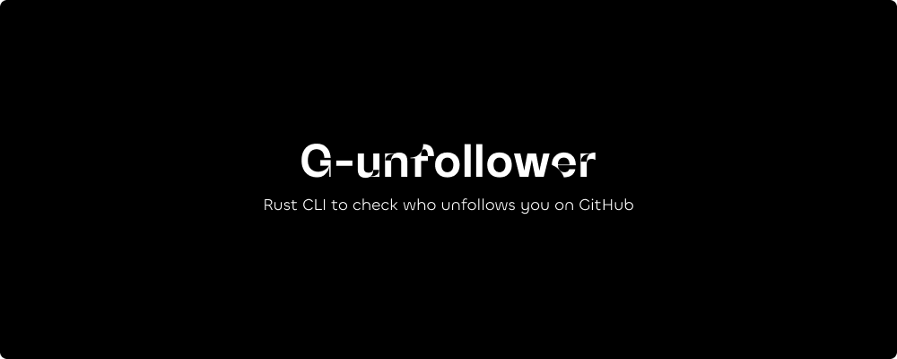

> A CLI written in rust to check who follows and unfollows you on GitHub

# G-unfollower

This is the Homebrew Formula repository for Gunfollower.

**Kindly visit https://github.com/DarthBenro008/gunfollower**